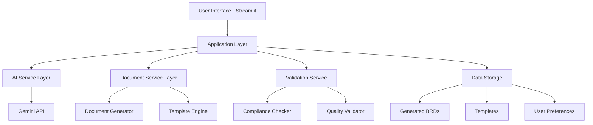
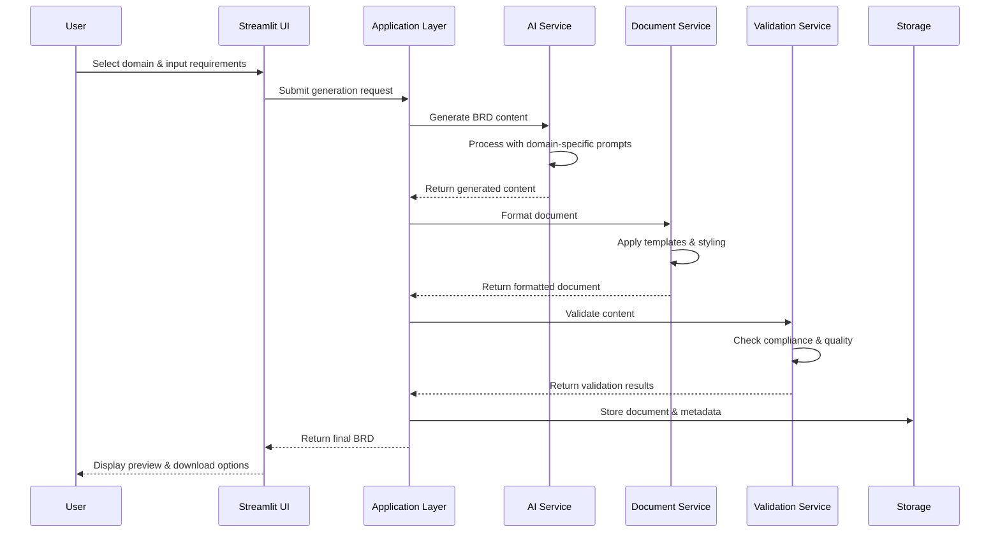

# System Architecture Design
## Intelligent BRD Generator for Domain-Specific Applications

### 1. Overview

This document outlines the system architecture for the Intelligent BRD Generator, a Generative AI-powered application that creates domain-specific Business Requirement Documents for Pharmaceutical and Financial sectors.

### 2. Architectural Principles

- **Modularity**: Components are loosely coupled and independently maintainable
- **Scalability**: System can handle increased user load and document generation requests
- **Security**: API keys and user data are properly secured
- **Extensibility**: New domains and templates can be easily added
- **Performance**: Optimized for fast document generation and export

### 3. High-Level Architecture



### 4. Component Architecture

#### 4.1 Frontend Layer (Streamlit)
- **Technology**: Streamlit web framework
- **Responsibilities**:
  - User input forms
  - Domain selection interface
  - Document preview
  - Export functionality
  - User preferences management

#### 4.2 Application Layer
- **Technology**: Python
- **Responsibilities**:
  - Request orchestration
  - Session management
  - Error handling
  - Response formatting
  - API integration coordination

#### 4.3 AI Service Layer
- **Technology**: Google Generative AI SDK
- **Responsibilities**:
  - Prompt engineering
  - API communication with Gemini
  - Response processing
  - Domain-specific context management

#### 4.4 Document Service Layer
- **Technology**: python-docx, Jinja2
- **Responsibilities**:
  - Document structure generation
  - Template application
  - Format styling
  - Export functionality

#### 4.5 Validation Service
- **Technology**: Custom Python modules
- **Responsibilities**:
  - Compliance checking
  - Content validation
  - Quality assessment
  - Error reporting

#### 4.6 Data Storage
- **Technology**: Local file system (initial), can be extended to cloud storage
- **Responsibilities**:
  - Template storage
  - Generated document storage
  - User preference persistence
  - Audit trail maintenance

### 5. Data Flow Architecture



### 6. Technology Stack

#### 6.1 Frontend Technologies
- **Streamlit**: Web application framework
- **HTML/CSS**: Custom styling
- **JavaScript**: Client-side interactions (if needed)

#### 6.2 Backend Technologies
- **Python 3.8+**: Core programming language
- **Google Generative AI**: AI model integration
- **python-docx**: Document generation
- **Jinja2**: Template engine
- **Pandas**: Data manipulation (if needed)

#### 6.3 Development & Deployment
- **Git**: Version control
- **pip**: Package management
- **Docker** (optional): Containerization
- **Google Cloud Run**: Deployment platform

### 7. Security Architecture

#### 7.1 API Security
- Environment variable storage for API keys
- Request rate limiting
- Input validation and sanitization
- Error handling without exposing sensitive information

#### 7.2 Data Security
- Local file storage with proper permissions
- Temporary file cleanup
- Input data validation
- Secure document export

### 8. Directory Structure

```
brd-generator/
├── app.py                 # Main Streamlit application
├── config/
│   ├── __init__.py
│   ├── settings.py        # Application configuration
│   └── api_keys.py        # API key management
├── services/
│   ├── __init__.py
│   ├── ai_service.py      # AI integration layer
│   ├── document_service.py # Document generation
│   └── validation_service.py # Content validation
├── templates/
│   ├── pharma_template.py # Pharma domain template
│   ├── finance_template.py # Finance domain template
│   └── base_template.py   # Base template structure
├── prompts/
│   ├── pharma_prompts.py  # Pharma-specific prompts
│   ├── finance_prompts.py # Finance-specific prompts
│   └── base_prompts.py    # Base prompt structure
├── utils/
│   ├── __init__.py
│   ├── helpers.py         # Utility functions
│   └── validators.py      # Input validation
├── data/
│   ├── templates/         # Document templates
│   ├── generated/         # Generated BRDs
│   └── compliance/        # Compliance reference data
├── tests/
│   ├── __init__.py
│   ├── test_ai_service.py
│   ├── test_document_service.py
│   └── test_validation.py
├── requirements.txt       # Python dependencies
├── .env                   # Environment variables
└── README.md             # Project documentation
```

### 9. API Integration Architecture

#### 9.1 Gemini API Integration
```python
# Example integration pattern
class GeminiService:
    def __init__(self, api_key: str):
        self.api_key = api_key
        genai.configure(api_key=api_key)
        self.model = genai.GenerativeModel('models/gemini-2.5-pro-preview-03-25')
    
    def generate_content(self, prompt: str, domain: str) -> str:
        # Domain-specific prompt enhancement
        enhanced_prompt = self._enhance_prompt(prompt, domain)
        response = self.model.generate_content(enhanced_prompt)
        return response.text
```

#### 9.2 Error Handling Strategy
- Retry mechanisms for API failures
- Graceful degradation for service unavailability
- User-friendly error messages
- Logging for debugging and monitoring

### 10. Performance Considerations

#### 10.1 Response Time Optimization
- Asynchronous processing for long-running operations
- Caching of frequently used templates
- Optimized prompt engineering
- Efficient document generation

#### 10.2 Resource Management
- Memory-efficient document processing
- Connection pooling for API calls
- Temporary file cleanup
- Session management

### 11. Scalability Architecture

#### 11.1 Horizontal Scaling
- Stateless application design
- Load balancing capability
- Distributed caching (if needed)
- Microservices readiness

#### 11.2 Vertical Scaling
- Resource monitoring
- Performance optimization
- Memory management
- CPU utilization optimization

### 12. Monitoring and Logging

#### 12.1 Application Monitoring
- Response time tracking
- Error rate monitoring
- User activity logging
- Resource utilization monitoring

#### 12.2 Business Metrics
- Document generation success rate
- User satisfaction scores
- Domain accuracy metrics
- Compliance coverage statistics

### 13. Deployment Architecture

#### 13.1 Development Environment
- Local development setup
- Version control integration
- Automated testing
- Code quality checks

#### 13.2 Production Environment
- Cloud deployment on Google Cloud Run
- Environment-specific configurations
- Secure API key management
- Backup and recovery procedures

### 14. Integration Points

#### 14.1 External Integrations
- Google Gemini API
- Document export libraries
- Compliance reference databases
- Template management system

#### 14.2 Internal Integrations
- Frontend-backend communication
- Service-to-service interactions
- Data storage operations
- Validation workflows

### 15. Future Enhancements

#### 15.1 Planned Improvements
- Multi-language support
- Advanced collaboration features
- Enterprise authentication
- Cloud storage integration
- Advanced analytics dashboard

#### 15.2 Extension Points
- New domain support
- Additional export formats
- Custom template engine
- Advanced validation rules
- Integration with external systems

### 16. Technical Risks and Mitigations

| Risk | Impact | Mitigation Strategy |
|------|--------|-------------------|
| API rate limits | High | Implement caching and retry mechanisms |
| Large document generation | Medium | Optimize memory usage and processing |
| Template complexity | Medium | Modular template design |
| Security vulnerabilities | High | Regular security audits and updates |
| Performance degradation | Medium | Continuous monitoring and optimization |

This architecture provides a solid foundation for implementing the Intelligent BRD Generator while ensuring scalability, security, and maintainability.